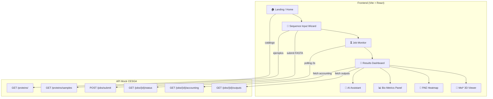

# 🧬 LocalFold — Plan de Diseño del Impacthon 2026

> **Reto:** BioHack: Democratizando el plegamiento de proteínas  
> **Duración:** 2 días (10–12 abril 2026)  
> **Equipo:** 4 personas  
> **API:** https://api-mock-cesga.onrender.com

---

## 1. Análisis Estratégico — Criterios de Evaluación

Los criterios están **ordenados por prioridad**. Nuestra estrategia debe focalizarse en los primeros.

| # | Criterio | Peso | Nuestra estrategia |
|---|----------|------|--------------------|
| 1º | **UX orientada al biólogo + IA** | 🔴 Máximo | Wizard paso a paso, tooltips educativos, LLM para explicar resultados |
| 2º | **Visualización e interpretabilidad** | 🔴 Alto | Mol* embebido con coloreado pLDDT, heatmap PAE interactivo |
| 3º | **Gestión del ciclo de vida del job** | 🟡 Medio | Timeline visual PENDING→RUNNING→COMPLETED, logs en tiempo real |
| 4º | **Integración creativa de datos** | 🟡 Medio | Dashboard biológico: solubilidad, toxicidad, estructura secundaria |
| 5º | **Viabilidad para producción** | 🟢 Menor | Arquitectura modular, servicio API abstraído, manejo de errores |

> [!IMPORTANT]
> **NO se premia:** conectar al CESGA real, código perfecto, ni conocimiento biológico profundo.  
> **SÍ se premia:** UX intuitiva, visualizaciones espectaculares, y uso creativo de IA.

---

## 2. Arquitectura Técnica Propuesta



### Stack Tecnológico

| Capa | Tecnología | Justificación |
|------|-----------|---------------|
| **Build** | Vite | Rápido, HMR instantáneo, ideal para hackathon |
| **UI** | React 18 | Componentización, hooks, ecosistema maduro |
| **Estilos** | CSS Modules + Variables CSS | Control total, sin overhead de librerías |
| **3D Viewer** | Mol* (molstar) | Mismo visor que AlphaFold DB oficial — criterio 2 |
| **Heatmap PAE** | Plotly.js o Canvas nativo | Heatmap interactivo con zoom/tooltip |
| **Charts** | Recharts o Chart.js | Gráficos de barras pLDDT, donut estructura secundaria |
| **IA/LLM** | API de OpenAI / Gemini (opcional) | Explicación de resultados en lenguaje natural |
| **Tipografía** | Google Fonts: Inter + JetBrains Mono | Científica pero moderna |

---

## 3. Mapa de Pantallas y Componentes

### 3.1 🏠 Landing Page — `"/"`
- Hero con animación de proteína 3D (o gradiente dinámico molecular)
- Breve explicación "¿Qué es LocalFold?" en lenguaje accesible
- CTA principal: "Analizar una secuencia" → va al wizard
- Sección de proteínas destacadas del catálogo (cards con mini info)
- Footer con logos CESGA / Cátedra CAMELIA / GDG

### 3.2 📝 Sequence Input — `"/submit"` (Wizard 3 pasos)

**Paso 1 — Seleccionar fuente:**
- Opción A: Pegar secuencia FASTA manualmente (textarea con validación en tiempo real)
- Opción B: Selecionar del catálogo de 22 proteínas (grid con búsqueda/filtros por categoría)
- Opción C: Subir fichero `.fasta`

**Paso 2 — Configurar recursos:**
- Preset buttons: "⚡ Rápido" (0 GPU, 4 CPU) / "⚙️ Estándar" (1 GPU, 8 CPU) / "🔬 Alta precisión" (2-4 GPU, 16+ CPU)
- Modo avanzado (colapsable): sliders para GPUs, CPUs, memoria, timeout
- Tooltips educativos explicando qué es cada recurso

**Paso 3 — Confirmar y enviar:**
- Resumen visual de la secuencia (longitud, nombre si detectado)
- Estimación de tiempo basada en el preset
- Botón "🚀 Lanzar predicción"

### 3.3 ⏳ Job Monitor — `"/jobs/:id"`
- **Timeline visual** horizontal: PENDING → RUNNING → COMPLETED (con animaciones)
- **Logs en vivo** (estilo terminal, con scroll automático)
- **Barra de progreso** animada durante RUNNING
- **Info del job** en sidebar: ID, fecha, recursos solicitados, filename
- Polling automático cada 2s con indicador visual de actividad
- Transición automática a Results cuando COMPLETED

### 3.4 🔬 Results Dashboard — `"/jobs/:id/results"`

> [!TIP]
> Esta es la pantalla más importante. Los jueces pasarán más tiempo aquí.

**Layout:** Grid responsive con 4 zonas principales

#### Zona 1 — Visor Molecular 3D (Mol*) `[60% ancho, arriba]`
- Mol* embebido con controles de rotación, zoom, selección
- **Coloreado por pLDDT** (azul oscuro > 90, azul claro 70-90, amarillo 50-70, naranja < 50)
- Toggle: coloreado por cadena / por pLDDT / por estructura secundaria
- Botón screenshot / fullscreen
- Exportar PDB / mmCIF

#### Zona 2 — Panel de Confianza `[40% ancho, arriba-derecha]`
- **pLDDT Score** grande en circle gauge (ej: 71.7/100)
- **Histograma de confianza**: barras de colores (very_high, high, medium, low)
- **PAE medio** con interpretación textual
- **Gráfico lineal pLDDT por residuo** (sparkline interactivo)

#### Zona 3 — Heatmap PAE `[100% ancho, centro]`
- Heatmap 2D de la matriz PAE (canvas/plotly)
- Coloreado: azul (0 Å) → amarillo → rojo (>15 Å)
- Tooltip al hover mostrando residuos i,j y valor en Å
- Interpretación automática: "Se detectaron X dominios bien definidos"

#### Zona 4 — Datos Biológicos `[100% ancho, abajo]`
- **Cards métricas** en row:
  - 💧 Solubilidad (gauge circular)
  - ⚖️ Estabilidad (índice de inestabilidad + badge stable/unstable)
  - ⚠️ Toxicidad (lista de alertas con iconos)
  - 🌸 Alergenicidad (lista de alertas)
- **Estructura secundaria**: donut chart (α-hélice / β-lámina / coil)
- **Propiedades de secuencia**: peso molecular, cargas, cisteínas, aromáticos
- **Accounting HPC**: mini dashboard con CPU-hours, GPU-hours, eficiencias

#### Zona Bonus — 🤖 AI Assistant (Panel lateral o modal)
- Chat empotrado que explica los resultados en lenguaje natural
- Prompt pre-cargado con el contexto de los datos de la proteína
- Ejemplo: "Tu proteína tiene un pLDDT de 71.7, lo que indica una confianza moderada. Las regiones 45-60 muestran baja confianza, lo que podría indicar regiones intrínsecamente desordenadas..."

### 3.5 📋 Jobs History — `"/jobs"`
- Lista/tabla de todos los jobs enviados
- Status badge con colores
- Click → ir al monitor o resultados
- Filtros por estado

---

## 4. Especificaciones de Diseño Visual

### Paleta de Colores

```css
:root {
  /* Base — Modo oscuro elegante */
  --bg-primary: #0a0e1a;
  --bg-secondary: #111827;
  --bg-card: #1a1f35;
  --bg-card-hover: #232942;
  
  /* Acentos — inspirados en biología molecular */
  --accent-primary: #6366f1;    /* Indigo vibrante */
  --accent-secondary: #06b6d4;  /* Cyan molecular */
  --accent-gradient: linear-gradient(135deg, #6366f1, #06b6d4);
  
  /* pLDDT Colors (estándar AlphaFold) */
  --plddt-very-high: #0053d6;   /* Azul oscuro >90 */
  --plddt-high: #65cbf3;        /* Azul claro 70-90 */
  --plddt-medium: #ffdb13;      /* Amarillo 50-70 */
  --plddt-low: #ff7d45;         /* Naranja <50 */
  
  /* Estado del job */
  --status-pending: #f59e0b;
  --status-running: #3b82f6;
  --status-completed: #10b981;
  --status-failed: #ef4444;
  
  /* Texto */
  --text-primary: #f1f5f9;
  --text-secondary: #94a3b8;
  --text-muted: #64748b;
}
```

### Tipografía
- **Headings**: `Inter`, 600-700 weight
- **Body**: `Inter`, 400-500 weight
- **Code/Data**: `JetBrains Mono`, 400 weight (secuencias FASTA, IDs, métricas)

### Efectos Visuales
- **Glassmorphism** en cards: `backdrop-filter: blur(16px); background: rgba(26, 31, 53, 0.8)`
- **Micro-animaciones**: transiciones de 200-300ms en hover, entrada de cards con fade-in
- **Gradientes sutiles** en bordes de cards activas
- **Partículas/DNA helix** como fondo animado sutil en la landing
- **Skeleton loading** durante fetch de datos

---

## 5. División del Trabajo — 4 Personas × 2 Días

### Roles

| Rol | Persona | Responsabilidad Principal |
|-----|---------|--------------------------|
| **P1 — Lead Frontend / Architecture** | Persona 1 | Scaffolding, routing, layout, sistema de diseño, integración final |
| **P2 — API Integration / Job Flow** | Persona 2 | Servicio API, wizard de input, monitor de jobs, polling, manejo de errores |
| **P3 — 3D Viewer / Visualizaciones** | Persona 3 | Mol* integration, heatmap PAE, gráficos pLDDT, charts biológicos |
| **P4 — UX / Landing / IA / Demo** | Persona 4 | Landing page, tooltips educativos, AI assistant, pulido UX, preparar demo |

---

## 6. Cronograma Detallado

### 📅 DÍA 1 — Fundación y Core

#### Bloque 1: Setup (primeras 2-3h)

| Persona | Tarea | Entregable |
|---------|-------|------------|
| **P1** | Crear proyecto Vite+React, configurar estructura de carpetas, CSS variables, tipografía, router, layouts base | Proyecto corriendo con navegación entre páginas vacías |
| **P2** | Crear servicio `api.js` con todas las funciones (submitJob, getStatus, getOutputs, getAccounting, getProteins, getSamples) | Módulo API completo y testeado con console.log |
| **P3** | Investigar e instalar Mol*, hacer PoC mínimo: cargar un PDB hardcodeado en un componente React | Componente `<MolViewer pdb={string}>` funcionando |
| **P4** | Diseñar wireframes rápidos de las 4 pantallas, definir copy educativo (tooltips de pLDDT, PAE, FASTA) | Mockups en papel/Figma + textos de tooltips listos |

#### Bloque 2: Core Features (siguientes 4-5h)

| Persona | Tarea | Entregable |
|---------|-------|------------|
| **P1** | Landing page (hero, CTA, catálogo de proteínas cards), componentes reutilizables (Button, Card, Badge, StatusBadge) | Landing page completa y navegable |
| **P2** | Wizard de 3 pasos: selector de fuente FASTA, configuración de recursos (presets), pantalla de confirmación y envío | Flujo completo: seleccionar proteína → configurar → submit → recibir job_id |
| **P3** | Componente Mol* completo con coloreado por pLDDT, controles, fullscreen. Iniciar heatmap PAE con Canvas/Plotly | Visor 3D coloreado por pLDDT funcionando con datos reales de la API |
| **P4** | Diseño y maquetación de la página de resultados (layout grid), componentes de métricas (gauge circles, barras), tooltips | Layout de resultados con componentes dummy que aceptan props |

#### Bloque 3: Cierre Día 1 (última 1-2h)

| Persona | Tarea |
|---------|-------|
| **P1** | Integrar componentes de P2, P3, P4 en el router. Resolver conflictos |
| **P2** | Job Monitor: timeline visual, polling cada 2s, logs simulados, transición a resultados |
| **P3** | Conectar visor 3D con datos reales del endpoint /outputs |
| **P4** | Revisar UX global, identificar gaps, listar prioridades para día 2 |

> [!IMPORTANT]
> **Meta Día 1:** Tener el flujo COMPLETO funcionando end-to-end (pegar FASTA → submit → monitor → ver resultados con visor 3D y métricas básicas), aunque sea feo o con bugs.

---

### 📅 DÍA 2 — Pulido, IA y Demo

#### Bloque 4: Completar features (primeras 3-4h)

| Persona | Tarea | Entregable |
|---------|-------|------------|
| **P1** | Historial de jobs (`/jobs`), navegación global, responsive, manejo de errores globales, loading states | Todas las páginas navegables, skeleton loading, error boundaries |
| **P2** | Panel de accounting HPC, descarga de ficheros (PDB, mmCIF, JSON), manejo de edge cases (FAILED, red errors) | Botones de descarga funcionales, estados de error elegantes |
| **P3** | Heatmap PAE interactivo finalizado, gráfico lineal pLDDT por residuo, donut de estructura secundaria, cards de datos biológicos | Todos los gráficos funcionando con datos reales |
| **P4** | **AI Assistant**: integrar LLM (OpenAI/Gemini API) que recibe el contexto de los resultados y genera explicaciones en lenguaje natural | Chat/panel con explicación automática de resultados para biólogos |

#### Bloque 5: Pulido visual (siguientes 2-3h)

| Persona | Tarea |
|---------|-------|
| **P1** | Pulido CSS global: glassmorphism, gradientes, animaciones de entrada, hover effects, transiciones entre páginas |
| **P2** | Pulir wizard UX: validación FASTA en tiempo real, feedback visual al pegar, auto-detección de proteína |
| **P3** | Animaciones en gráficos, transiciones suaves en cambio de vista del visor 3D, responsive de visualizaciones |
| **P4** | Tooltips educativos finales, micro-copy, onboarding sutil, empty states, verificar que un biólogo entienda todo |

#### Bloque 6: Demo y presentación (últimas 2h)

| Persona | Tarea |
|---------|-------|
| **P1** | Deploy (Vercel/Netlify), testing final cross-browser, fix bugs críticos |
| **P2** | Preparar secuencia de demo (ubiquitina — 76aa, la más rápida), verificar flujo completo sin errores |
| **P3** | Screenshots/videos del visor 3D y heatmaps para la presentación |
| **P4** | **Preparar pitch de 3 minutos** + slides de apoyo. Narrativa: problema → solución → demo live → futuro CESGA |

---

## 7. Elementos Diferenciadores (Bonus Points)

### 🤖 Integración IA — Alto impacto en criterio 1

1. **Explicador de resultados**: LLM que dado el pLDDT, PAE, solubilidad, etc., genera un resumen en lenguaje natural para biólogos
2. **Validador de secuencias**: al pegar un FASTA, verificar formato y sugerir correcciones
3. **Pregunta-respuesta**: "¿Qué significa que mi proteína tenga baja solubilidad?" → respuesta contextualizada

### 🎯 Features extra de alto impacto visual

| Feature | Impacto | Esfuerzo |
|---------|---------|----------|
| Coloreado pLDDT en Mol* con leyenda interactiva | 🔴 Altísimo | Medio |
| Heatmap PAE clickeable que resalta residuos en el 3D | 🔴 Altísimo | Alto |
| Animación de proteína girando en la landing | 🟡 Medio | Bajo |
| Modo comparación de 2 proteínas side-by-side | 🟡 Diferenciador | Alto |
| Dark/Light mode toggle | 🟢 Bajo | Bajo |

---

## 8. Estructura de Carpetas Propuesta

```
localfold/
├── public/
│   └── favicon.svg
├── src/
│   ├── assets/             # Imágenes, iconos
│   ├── components/         # Componentes reutilizables
│   │   ├── ui/             # Button, Card, Badge, Gauge, Tooltip
│   │   ├── layout/         # Header, Footer, Sidebar, PageLayout
│   │   ├── viewer/         # MolViewer, PAEHeatmap
│   │   ├── charts/         # PLDDTChart, SecondaryStructureDonut, SolubilityGauge
│   │   └── ai/             # AIAssistant, AIExplanation
│   ├── pages/              # Páginas principales
│   │   ├── Home.jsx
│   │   ├── Submit.jsx      # Wizard 3 pasos
│   │   ├── JobMonitor.jsx
│   │   ├── Results.jsx
│   │   └── JobsHistory.jsx
│   ├── services/
│   │   ├── api.js           # Funciones de llamada a la API CESGA
│   │   └── ai.js            # Integración con LLM
│   ├── hooks/
│   │   ├── useJobPolling.js  # Hook para polling de status
│   │   └── useProtein.js     # Hook para datos de proteínas
│   ├── utils/
│   │   ├── fastaParser.js    # Validación y parsing de FASTA
│   │   ├── plddtColors.js    # Mapeo de pLDDT a colores AlphaFold
│   │   └── formatters.js     # Formateo de números, tiempos, etc.
│   ├── styles/
│   │   ├── index.css         # Variables globales, reset, tipografía
│   │   ├── components.css    # Estilos de componentes compartidos
│   │   └── animations.css    # Keyframes y transiciones
│   ├── App.jsx
│   └── main.jsx
├── index.html
├── package.json
└── vite.config.js
```

---

## 9. Estrategia de Demo

### Guión de Demo (3 min)

1. **Problema** (30s): "Los biólogos no pueden usar AlphaFold sin saber Linux y GPUs"
2. **Solución** (15s): "LocalFold: un portal web que conecta investigadores con el supercomputador CESGA"
3. **Demo Live** (1:30):
   - Abrir landing → mostrar catálogo de proteínas
   - Seleccionar Ubiquitina del catálogo (o pegar FASTA)
   - Elegir preset "Estándar" → Enviar
   - Ver timeline: PENDING → RUNNING → COMPLETED (en ~10s)
   - **Resultados**: girar la proteína 3D coloreada por pLDDT
   - Mostrar heatmap PAE y explicar dominios
   - Abrir AI Assistant que explica los resultados
4. **Diferenciación** (30s): "Integración de IA, tooltips educativos, diseñado para biólogos"
5. **Futuro** (15s): "Listo para conectarse al CESGA real con cambios mínimos"

### Proteína para la Demo
> **Ubiquitina** (76 aminoácidos) — es la más pequeña del catálogo, procesa en ~10s, tiene metadata real, y es una proteína icónica que cualquier biólogo reconoce.

---

## 10. Open Questions

> [!IMPORTANT]  
> **Preguntas para el equipo antes de empezar:**

1. **¿Qué framework preferís?** El plan asume React + Vite. ¿Alguien prefiere Vue, Svelte, o vanilla JS?
2. **¿Tenéis API key de OpenAI/Gemini** para el asistente IA? Si no, podemos simular las respuestas con texto pre-generado.
3. **¿Nivel de experiencia del equipo con React?** Si alguno no tiene experiencia, se puede adaptar su rol a más CSS/diseño.
4. **¿Queréis modo claro/oscuro** o solo dark mode? (Dark mode es más rápido y más impactante visualmente)
5. **¿Tenéis las especificaciones de diseño adicionales** que mencionáis? Me las podéis compartir para integrarlas en el plan.
6. **¿Hay alguna preferencia sobre el hosting** para el deploy? (Vercel es gratis e inmediato con Vite+React)

---

## Verificación

### Automated Tests
- Verificar que la API responde: `curl https://api-mock-cesga.onrender.com/health`
- Flujo completo end-to-end: submit → poll → outputs con Ubiquitina
- Validación de formato FASTA (con y sin header)

### Manual Verification  
- Demo completa con Ubiquitina (flujo feliz)
- Demo con proteína grande (p53, 393 aa) para verificar tiempos
- Demo con secuencia inválida (sin header `>`) para verificar manejo de errores
- Verificar que el visor 3D funciona en Chrome, Firefox y Safari
- Pedir a alguien no-técnico que intente usar el portal sin ayuda (test de usabilidad)
